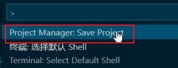
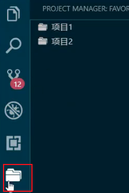
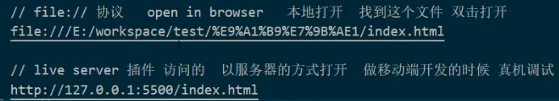
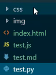
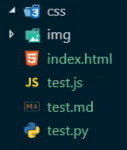
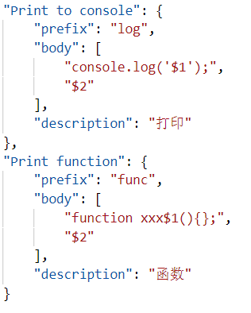

# vscode使用指南

1.home ——》回到行首 ;end ———》回到行尾;

2.ctrl+home ——》回到文档顶部；ctrl+end ——》回到文档尾部

3.alt+shift+上下箭头 ——》复制行

4.单行注释——》ctrl+/

5.多行注释 ——》alt+shif+a

6.删除——》ctrl+shift+k

7.代码格式化——》alt+shift+f

## 批量

1.批量修改——》按住alt，点击要修改的地方

2.修改多行代码的尾部 ——》选中代码块+alt+shift+i

## 安装插件

### import Cost  ——》分析以及显示当前引入库的大小
### Paste Image（快速（在markDown）粘贴图片） ——》ctrl+alt+v 
### Projext Manager (项目管理：方便切换项目) ——》ctrl+ship+p——》调出命令版去保存要管理的项目
### code Runner ——》安装后右键选择Run code 就可以运行当前js文件/选中代码块
### Auto Rename Tag ——》安装后就便于书写html文档
### Open in browser ——》安装后右键选择后就能快速打开浏览器
### Document This ——》快速写注释

保存的项目都在     中
点击如下任一项目就可以切换到那个项目中

live Server

### vscode-icons 
安装前

安装后：

### Document This ——》快速生成注释
通过按两次 ctrl+alt+D 快速增加注释

## 设置用户代码块
文件——》首选项——》用户代码片段
注：$1是代码块展示第一次出现的位置 ； $2按tab键光标的第二次位置

